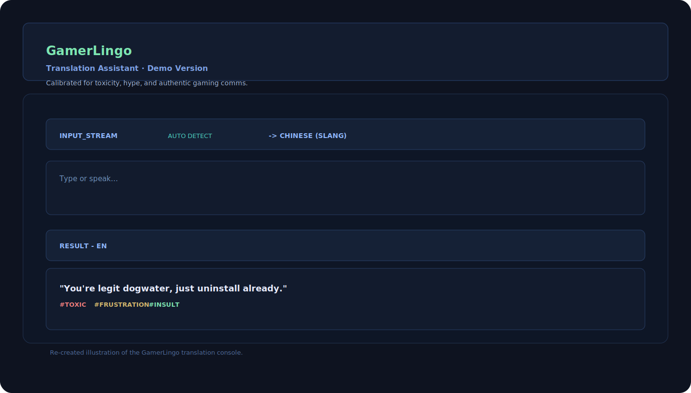
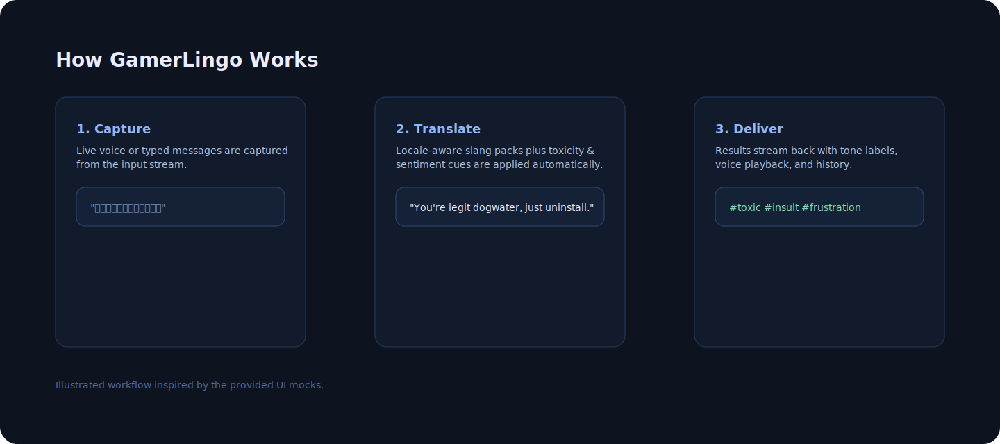

# GamerLingo

Recreated from the provided product mocks, **GamerLingo** is a translation assistant tuned for gaming chatter, hype, and toxicity detection. The UI pairs a voice-enabled input stream with automatic language detection, slang-aware output, and sentiment tags so squads can stay on the same wavelength.

<div align="center">
  
</div>

## Features
- **Live capture** – type or press the mic to stream voice directly into the translator.
- **Auto detection** – source language is detected automatically; target dialects include slang-friendly presets.
- **Tone labels** – toxicity, frustration, and insult tags show how spicy the message is.
- **History + replay** – translations can be revisited, copied, or replayed to practice pronunciation.
- **Gemini-powered** – integrates with Gemini for responsive, gaming-aware translations (configure your key before running).

## Quick start
1. Install dependencies: `npm install`
2. Provide credentials: set `GEMINI_API_KEY` in `.env.local`
3. Run the dev server: `npm run dev`
4. Open the app at the printed localhost URL.

## How it works
<div align="center">
  
</div>

1. **Capture** – grab typed or spoken input from the stream.
2. **Translate** – apply slang-aware translation plus tone detection.
3. **Deliver** – return responses with sentiment chips, audio playback, and a practice score.

## Scripts
- `npm run dev` – start the Vite dev server
- `npm run build` – produce a production bundle
- `npm run preview` – preview the production bundle locally

## Environment
Create `.env.local` with your Gemini key:

```
GEMINI_API_KEY=your_api_key_here
```

## Project structure
- `App.tsx`, `index.tsx` – entry points and layout
- `components/` – UI modules like `InputArea`, `TranslationBox`, and `ResultDisplay`
- `services/` – API client helpers
- `constants.ts`, `types.ts` – shared values and typings

The visuals above mirror the two provided screenshots while keeping the instructions in one place for quick onboarding.
